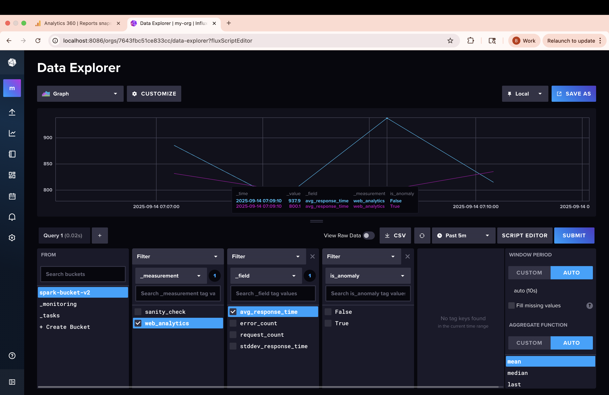
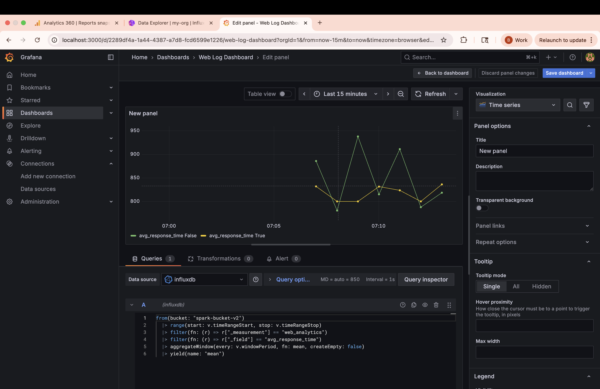

# Real-Time Log Analytics & Anomaly Detection Pipeline

This project demonstrates a simulated real-time log analytics and anomaly detection pipeline using Apache Spark Structured Streaming, Kafka, and InfluxDB. It simulates web server logs, processes them in real-time to detect anomalies, and stores the results in InfluxDB/Grafana for visualization and observability.

## Architecture

The data flows through the system as follows:

1. Log Producer-> Kafka -> Spark Structured Streaming- > InfluxDB ➔ Grafana

2. Data Ingestion: A Python script simulates user activity and produces log messages to an Apache Kafka topic.

3. Stream Processing: A multi-node Apache Spark cluster consumes the data in real-time, performing aggregations over 1-minute windows to calculate request counts, average response times, error rates, and standard deviation.

4. Anomaly Detection: Within the Spark job, a set of business rules flags any 1-minute window with an abnormally high error rate or erratic response times as an anomaly.

5. Data Storage: The resulting time-series analytics are written to InfluxDB, a database optimized for this type of data.

6. Visualization: A Grafana dashboard connects to InfluxDB to provide a live, interactive view of the website's health and any detected anomalies.

## How to Run

1. Ensure you have Docker and Docker Compose installed on your machine.
2. Clone this repository to your local machine.

```bash
git clone <https://github.com/benbatman/big-data.git>
cd big-data/anomaly_detection
```

3. Build the custom spark image

```bash
docker build -t custom-spark-image
```

4. Launch Environment

```bash
docker compose up -d
```

5. Start Data Producer

```bash
python3 log_producer
```

6. View Kafka Topic (Optional)

```bash
docker exec -it anomaly_detection-kafka-1 kafka-console-consumer.sh --bootstrap-server localhost:9092 --topic web_logs_v2 --from-beginning
```

7. Submit Spark Job

```bash
docker exec anomaly_detection-spark-master-1 spark-submit \
--packages org.apache.spark:spark-sql-kafka-0-10_2.12:3.5.1 \
--master spark://spark-master:7077 \
/opt/bitnami/spark/app/stream_processor.py
```

8. View/Build Dashboard

```
- Grafana: http://localhost:3000 (admin/admin)
- InfluxDB: http://localhost:8086 (admin/password123)
```

You should see something like:



